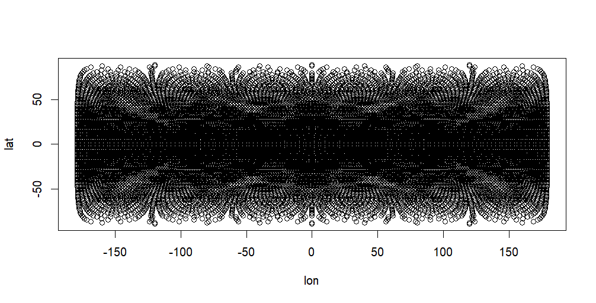

# Análisis Climático por Estaciones

Este proyecto muestra el análisis de datos climáticos extraídos desde archivos NetCDF. A continuación se presentan los procedimientos utilizados para el procesamiento de datos, junto con los resultados gráficos divididos por estación.

---

## 📌 Índice

- [1. Extracción y apertura de datos climáticos](#1-extracción-y-apertura-de-datos-climáticos)
- [2. Análisis por estación](#2-análisis-por-estación)
  - [2.1 Invierno](#21-invierno)
  - [2.2 Primavera](#22-primavera)
  - [2.3 Verano](#23-verano)
  - [2.4 Otoño](#24-otoño)

---

 1. Extracción y apertura de datos climáticos

Se trabajó con archivos `.nc` (NetCDF) que contienen datos de temperatura y coordenadas geográficas. Estos fueron extraídos y organizados para su posterior análisis.

```r
library(ncdf4)

# Abrir archivo NetCDF
data <- nc_open("archivo.nc")

# Extraer variables
lon <- ncvar_get(data, "lon")
lat <- ncvar_get(data, "lat")
temp <- ncvar_get(data, "temperature")

# Cerrar archivo
nc_close(data)

# Mostrar grafico de temperaturas globales
plot(lon,lat)
```


 2. Promedio mensual por estación
Se calcula el promedio mensual para cada estación, agrupando por coordenadas y fechas.

```r
library(dplyr)
library(lubridate)

# Convertir tiempo
time <- ncvar_get(data, "time")
origin <- "1900-01-01"
dates <- as.Date(time, origin = origin)

# Agrupar por mes y calcular promedio
monthly_avg <- temp %>%
  group_by(month = month(dates), lat, lon) %>%
  summarise(mean_temp = mean(value, na.rm = TRUE))
```
3. Análisis PCA por estación
A continuación se presentan los resultados para cada estación: screeplot, PCA y heatmap.
3.1 Invierno
Código PCA:
```r
# Filtrar meses de invierno
invierno <- monthly_avg %>% filter(month %in% c(12, 1, 2))

# Matriz para PCA
mat <- spread(invierno, key = lon, value = mean_temp)

# PCA
pca_inv <- prcomp(mat, scale. = TRUE)

# Screeplot
plot(pca_inv, type = "l")

# Biplot
biplot(pca_inv)

```
3.2 Primavera
Código PCA:
```r
primavera <- monthly_avg %>% filter(month %in% c(3, 4, 5))
mat <- spread(primavera, key = lon, value = mean_temp)
pca_prim <- prcomp(mat, scale. = TRUE)
plot(pca_prim, type = "l")
biplot(pca_prim)

```
3.3 Verano
Código PCA:
```r
verano <- monthly_avg %>% filter(month %in% c(6, 7, 8))
mat <- spread(verano, key = lon, value = mean_temp)
pca_ver <- prcomp(mat, scale. = TRUE)
plot(pca_ver, type = "l")
biplot(pca_ver)

```
3.4 Otoño
Código PCA:
```r
otonio <- monthly_avg %>% filter(month %in% c(9, 10, 11))
mat <- spread(otonio, key = lon, value = mean_temp)
pca_oto <- prcomp(mat, scale. = TRUE)
plot(pca_oto, type = "l")
biplot(pca_oto)

```
