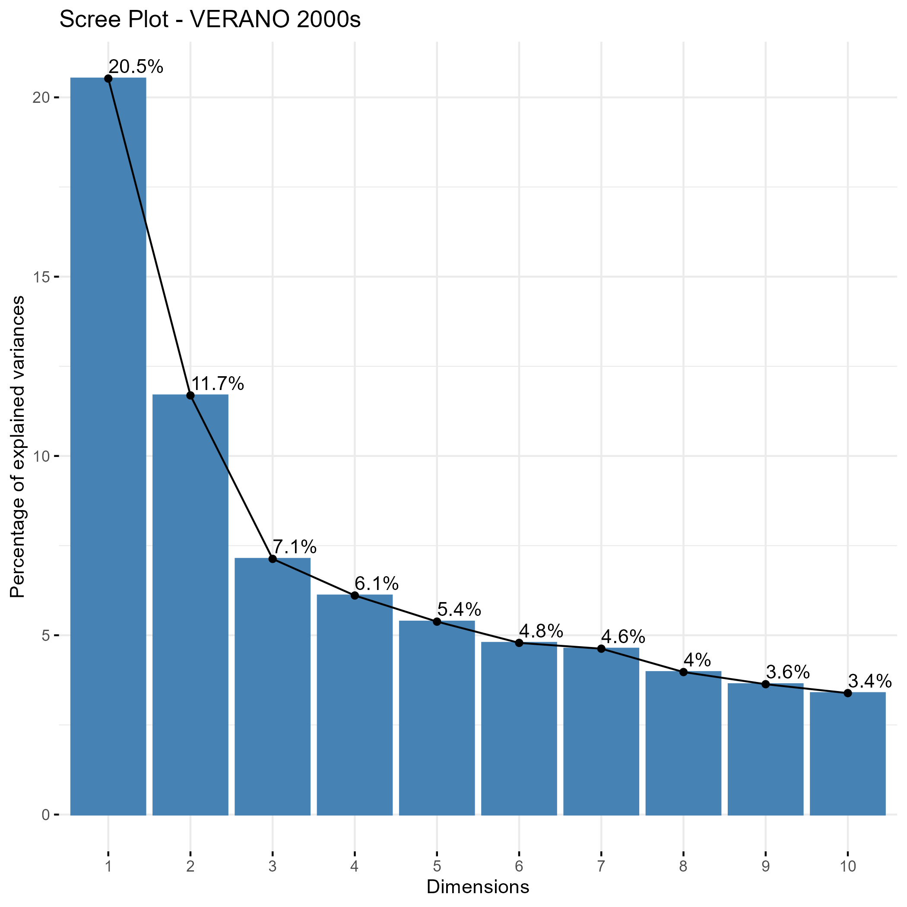

📊 Análisis de Temperaturas: PCA por Estación y Década
Este proyecto analiza los patrones espaciales y temporales de temperatura mediante Análisis de Componentes Principales (PCA), utilizando datos climáticos en formato NetCDF.

---

## 📌 Índice

1. [Extracción y apertura de datos climáticos](#1-extracción-y-apertura-de-datos-climáticos)
2. [Definición de estaciones, décadas y procesamiento temporal](#2-definición-de-estaciones-décadas-y-procesamiento-temporal)
3. [Funciones para análisis PCA y gráficos](#3-funciones-para-análisis-pca-y-gráficos)
4. [Análisis por estación y década](#4-análisis-por-estación-y-década)
   - [4.1 Invierno](#41-invierno)
     - [4.1.1 Década 1950s](#411-década-1950s)
     - [4.1.2 Década 1980s](#412-década-1980s)
     - [4.1.3 Década 2000s](#413-década-2000s)
     - [4.1.4 Comparación de temperaturas para invierno]
   - [4.2 Primavera](#42-primavera)
     - [4.2.1 Década 1950s](#421-década-1950s)
     - [4.2.2 Década 1980s](#422-década-1980s)
     - [4.2.3 Década 2000s](#423-década-2000s)
   - [4.3 Verano](#43-verano)
     - [4.3.1 Década 1950s](#431-década-1950s)
     - [4.3.2 Década 1980s](#432-década-1980s)
     - [4.3.3 Década 2000s](#433-década-2000s)
   - [4.4 Otoño](#44-otoño)
     - [4.4.1 Década 1950s](#441-década-1950s)
     - [4.4.2 Década 1980s](#442-década-1980s)
     - [4.4.3 Década 2000s](#443-década-2000s)
5. [Resultados](#5-resultados)


---

 1. Extracción y apertura de datos climáticos

Se trabajó con archivos `.nc` (NetCDF) que contienen datos de temperatura y coordenadas geográficas. Estos fueron extraídos y organizados para su posterior análisis.

```r
library(ncdf4)
library(dplyr)
library(tidyr)
library(ggplot2)
library(FactoMineR)
library(factoextra)
library(reshape2)
library(patchwork)

# Abrir archivo NetCDF
nc <- nc_open("archivo.nc")

# Extraer variables
lon <- ncvar_get(nc, "lon")
lat <- ncvar_get(nc, "lat")
temp <- ncvar_get(nc, "temperature")
tiempo <- ncvar_get(nc, "time")

# Cerrar archivo
nc_close(nc)

# Agregar columnas auxiliares
years <- floor(tiempo)
months <- round((tiempo - years) * 12) + 1

# Mostrar grafico de coordenadas globales
plot(lon,lat)
```


 2. Definición de estaciones, décadas y procesamiento temporal.
Se define la asignación de meses a estaciones climáticas y las décadas que se analizarán..

```r
tiempo_years <- floor(tiempo)

meses_estaciones <- list(
  invierno = c(12, 1, 2),
  primavera = c(3, 4, 5),
  verano    = c(6, 7, 8),
  otono     = c(9, 10, 11)
)

decadas <- list(
  `1950s` = 1950:1959,
  `1980s` = 1980:1989,
  `2000s` = 2000:2009
)

get_indices <- function(months) {
  unlist(lapply(months, function(m) seq(m, length(tiempo), by = 12)))
}

```

3. Funciones para análisis PCA y gráficos
Se definen funciones para limpiar datos, hacer PCA, y generar gráficos (Scree Plot, PCA plot y Heatmap).

```r
hacer_pca <- function(temp_subset) {
  na_rows <- apply(temp_subset, 1, function(x) all(is.na(x)))
  temp_clean <- temp_subset[!na_rows, ]
  pca <- PCA(temp_clean, scale.unit = TRUE, ncp = 5, graph = FALSE)
  return(list(pca = pca, temp_clean = temp_clean))
}

graficar_scree <- function(pca_obj, titulo) {
  fviz_eig(pca_obj, addlabels = TRUE) + ggtitle(titulo)
}

graficar_pca <- function(pca_obj, titulo) {
  fviz_pca_ind(pca_obj, axes = c(1, 2), geom = "point", pointsize = 2) +
    labs(title = titulo) +
    theme_minimal()
}

graficar_heatmap <- function(matriz, decada, estacion) {
  df <- as.data.frame(matriz)
  df$pixel <- 1:nrow(df)
  df_long <- melt(df, id.vars = "pixel", variable.name = "tiempo", value.name = "temperatura")
  df_long$tiempo <- as.numeric(gsub("V", "", df_long$tiempo)) + min(decadas[[decada]]) - 1
  
  ggplot(df_long, aes(x = tiempo, y = pixel, fill = temperatura)) +
    geom_tile() +
    scale_fill_viridis_c(option = "plasma", na.value = "grey80") +
    labs(title = paste("Heatmap -", toupper(estacion), "-", decada),
         x = "Año", y = "Pixel espacial") +
    theme_minimal()
}


```

3.1 Invierno general

```r
invierno <- monthly_avg %>% filter(month %in% c(12, 1, 2))
mat <- spread(invierno, key = lon, value = mean_temp)
pca_inv <- prcomp(mat, scale. = TRUE)
plot(pca_inv, type = "l")
biplot(pca_inv)

```
Screeplot:


PCA:


3.1.1 Análisis estacional por decada
Década 1950-1959

```r
invierno_50s <- invierno %>% filter(year %in% 1950:1959)
mat_50s <- spread(invierno_50s, key = lon, value = mean_temp)
pca_inv_50s <- prcomp(mat_50s, scale. = TRUE)
plot(pca_inv_50s, type = "l")
biplot(pca_inv_50s)
```
Screeplot:


PCA:


Heatmap


Década 1980-1989

```r
invierno_80s <- invierno %>% filter(year %in% 1980:1989)
mat_80s <- spread(invierno_80s, key = lon, value = mean_temp)
pca_inv_80s <- prcomp(mat_80s, scale. = TRUE)
plot(pca_inv_80s, type = "l")
biplot(pca_inv_80s)

```
Screeplot:


PCA:


Heatmap


Década 2000-2009

```r
invierno_00s <- invierno %>% filter(year %in% 2000:2009)
mat_00s <- spread(invierno_00s, key = lon, value = mean_temp)
pca_inv_00s <- prcomp(mat_00s, scale. = TRUE)
plot(pca_inv_00s, type = "l")
biplot(pca_inv_00s)

```
Screeplot:


PCA:


Heatmap


Comparación de temperaturas para invierno

```r
# PCA por década
pca_inv_50s <- prcomp(mat_50s, scale. = TRUE)
pca_inv_80s <- prcomp(mat_80s, scale. = TRUE)
pca_inv_00s <- prcomp(mat_00s, scale. = TRUE)

# Varianza explicada
var_50s <- summary(pca_inv_50s)$importance[2, ]
var_80s <- summary(pca_inv_80s)$importance[2, ]
var_00s <- summary(pca_inv_00s)$importance[2, ]

# Crear data frame
df_var <- tibble(
  PC = paste0("PC", 1:length(var_50s)),
  `1950s` = var_50s,
  `1980s` = var_80s,
  `2000s` = var_00s
) %>%
  pivot_longer(cols = -PC, names_to = "Década", values_to = "Varianza")

# Graficar
grafico <- ggplot(df_var, aes(x = PC, y = Varianza, fill = Década)) +
  geom_bar(stat = "identity", position = "dodge") +
  labs(
    title = "Comparación de Varianza Explicada por PCA - Invierno",
    y = "Proporción de varianza explicada",
    x = "Componente Principal"
  ) +
  scale_fill_brewer(palette = "Set2") +
  theme_minimal()

# Mostrar el gráfico
print(grafico)

# Guardar el gráfico como imagen
ggsave("varianza_pca_invierno.png", plot = grafico, width = 8, height = 5, dpi = 300)


```

3.2 Primavera general
Código PCA:

```r
primavera <- monthly_avg %>% filter(month %in% c(3, 4, 5))
mat <- spread(primavera, key = lon, value = mean_temp)
pca_prim <- prcomp(mat, scale. = TRUE)
plot(pca_prim, type = "l")
biplot(pca_prim)

```
Screeplot:


PCA:


3.2.1 Análisis estacional por decada
Década 1950-1959

```r
primavera_50s <- primavera %>% filter(year %in% 1950:1959)
mat_50s <- spread(primavera_50s, key = lon, value = mean_temp)
pca_prim_50s <- prcomp(mat_50s, scale. = TRUE)
plot(pca_prim_50s, type = "l")
biplot(pca_prim_90s)

```
Screeplot:


PCA:


Heatmap


Década 1980-1989

```r
primavera_80s <- primavera %>% filter(year %in% 1980:1989)
mat_80s <- spread(primavera_80s, key = lon, value = mean_temp)
pca_prim_80s <- prcomp(mat_80s, scale. = TRUE)
plot(pca_prim_80s, type = "l")
biplot(pca_prim_80s)

```
Screeplot:


PCA:


Heatmap


Década 2000-2009

```r
primavera_00s <- primavera %>% filter(year %in% 2000:2009)
mat_00s <- spread(primavera_00s, key = lon, value = mean_temp)
pca_prim_00s <- prcomp(mat_00s, scale. = TRUE)
plot(pca_prim_00s, type = "l")
biplot(pca_prim_00s)

```
Screeplot:


PCA:


Heatmap


Comparación de temperaturas para primavera

```r

# PCA por década
pca_prim_50s <- prcomp(mat_50s, scale. = TRUE)
pca_prim_80s <- prcomp(mat_80s, scale. = TRUE)
pca_prim_00s <- prcomp(mat_00s, scale. = TRUE)

# Varianza explicada
var_50s <- summary(pca_prim_50s)$importance[2, ]
var_80s <- summary(pca_prim_80s)$importance[2, ]
var_00s <- summary(pca_prim_00s)$importance[2, ]

# Crear data frame
df_var <- tibble(
  PC = paste0("PC", 1:length(var_50s)),
  `1950s` = var_50s,
  `1980s` = var_80s,
  `2000s` = var_00s
) %>%
  pivot_longer(cols = -PC, names_to = "Década", values_to = "Varianza")

# Graficar
grafico <- ggplot(df_var, aes(x = PC, y = Varianza, fill = Década)) +
  geom_bar(stat = "identity", position = "dodge") +
  labs(
    title = "Comparación de Varianza Explicada por PCA - Primavera",
    y = "Proporción de varianza explicada",
    x = "Componente Principal"
  ) +
  scale_fill_brewer(palette = "Set2") +
  theme_minimal()

# Mostrar el gráfico
print(grafico)

# Guardar el gráfico como imagen
ggsave("varianza_pca_primavera.png", plot = grafico, width = 8, height = 5, dpi = 300)


```

3.3 Verano general
Código PCA:

```r
verano <- monthly_avg %>% filter(month %in% c(6, 7, 8))
mat <- spread(verano, key = lon, value = mean_temp)
pca_ver <- prcomp(mat, scale. = TRUE)
plot(pca_ver, type = "l")
biplot(pca_ver)

```
Screeplot:


PCA:


3.2.1 Análisis estacional por decada
Década 1950-1959

```r
verano_50s <- verano %>% filter(year %in% 1950:1959)
mat_50s <- spread(verano_50s, key = lon, value = mean_temp)
pca_ver_50s <- prcomp(mat_50s, scale. = TRUE)
plot(pca_ver_50s, type = "l")
biplot(pca_ver_50s)

```
Screeplot:


PCA:


Heatmap


Década 1980-1989

```r
verano_80s <- verano %>% filter(year %in% 1980:1989)
mat_80s <- spread(verano_80s, key = lon, value = mean_temp)
pca_ver_80s <- prcomp(mat_80s, scale. = TRUE)
plot(pca_ver_80s, type = "l")
biplot(pca_ver_80s)

```
Screeplot:


PCA:


Heatmap


Década 2000-2009

```r
verano_00s <- verano %>% filter(year %in% 2000:2009)
mat_00s <- spread(verano_00s, key = lon, value = mean_temp)
pca_ver_00s <- prcomp(mat_00s, scale. = TRUE)
plot(pca_ver_00s, type = "l")
biplot(pca_ver_00s)

```
Screeplot:


PCA:


Heatmap


Comparación de temperaturas para verano

```r

# PCA por década
pca_verano_50s <- prcomp(mat_50s, scale. = TRUE)
pca_verano_80s <- prcomp(mat_80s, scale. = TRUE)
pca_verano_00s <- prcomp(mat_00s, scale. = TRUE)

# Varianza explicada
var_50s <- summary(pca_verano_50s)$importance[2, ]
var_80s <- summary(pca_verano_80s)$importance[2, ]
var_00s <- summary(pca_verano_00s)$importance[2, ]

# Crear data frame
df_var <- tibble(
  PC = paste0("PC", 1:length(var_50s)),
  `1950s` = var_50s,
  `1980s` = var_80s,
  `2000s` = var_00s
) %>%
  pivot_longer(cols = -PC, names_to = "Década", values_to = "Varianza")

# Graficar
grafico <- ggplot(df_var, aes(x = PC, y = Varianza, fill = Década)) +
  geom_bar(stat = "identity", position = "dodge") +
  labs(
    title = "Comparación de Varianza Explicada por PCA - Verano",
    y = "Proporción de varianza explicada",
    x = "Componente Principal"
  ) +
  scale_fill_brewer(palette = "Set2") +
  theme_minimal()

# Mostrar el gráfico
print(grafico)

# Guardar el gráfico como imagen
ggsave("varianza_pca_verano.png", plot = grafico, width = 8, height = 5, dpi = 300)

```

3.4 Otoño general
Código PCA:

```r
otono <- monthly_avg %>% filter(month %in% c(9, 10, 11))
mat <- spread(otono, key = lon, value = mean_temp)
pca_oto <- prcomp(mat, scale. = TRUE)
plot(pca_oto, type = "l")
biplot(pca_oto)

```
Screeplot:


PCA:


3.4.1 Análisis estacional por decada
Década 1950-1959

```r
otono_50s <- otono %>% filter(year %in% 1950:1959)
mat_50s <- spread(otono_50s, key = lon, value = mean_temp)
pca_oto_50s <- prcomp(mat_50s, scale. = TRUE)
plot(pca_oto_50s, type = "l")
biplot(pca_oto_50s)

```
Screeplot:


PCA:


Heatmap


Década 1980-1989

```r
otono_80s <- otono %>% filter(year %in% 1980:1989)
mat_80s <- spread(otono_80s, key = lon, value = mean_temp)
pca_oto_80s <- prcomp(mat_80s, scale. = TRUE)
plot(pca_oto_80s, type = "l")
biplot(pca_oto_80s)

```
Screeplot:


PCA:


Heatmap


Década 2000-2009

```r
otono_00s <- otono %>% filter(year %in% 2000:2009)
mat_00s <- spread(otono_00s, key = lon, value = mean_temp)
pca_oto_00s <- prcomp(mat_00s, scale. = TRUE)
plot(pca_oto_00s, type = "l")
biplot(pca_oto_00s)

```
Screeplot:


PCA:


Heatmap


Comparación de temperaturas para otoño

```r

# PCA por década
pca_otono_50s <- prcomp(mat_50s, scale. = TRUE)
pca_otono_80s <- prcomp(mat_80s, scale. = TRUE)
pca_otono_00s <- prcomp(mat_00s, scale. = TRUE)

# Varianza explicada
var_50s <- summary(pca_otono_50s)$importance[2, ]
var_80s <- summary(pca_otono_80s)$importance[2, ]
var_00s <- summary(pca_otono_00s)$importance[2, ]

# Crear data frame
df_var <- tibble(
  PC = paste0("PC", 1:length(var_50s)),
  `1950s` = var_50s,
  `1980s` = var_80s,
  `2000s` = var_00s
) %>%
  pivot_longer(cols = -PC, names_to = "Década", values_to = "Varianza")

# Graficar
grafico <- ggplot(df_var, aes(x = PC, y = Varianza, fill = Década)) +
  geom_bar(stat = "identity", position = "dodge") +
  labs(
    title = "Comparación de Varianza Explicada por PCA - Otono",
    y = "Proporción de varianza explicada",
    x = "Componente Principal"
  ) +
  scale_fill_brewer(palette = "Set2") +
  theme_minimal()

# Mostrar el gráfico
print(grafico)

# Guardar el gráfico como imagen
ggsave("varianza_pca_otono.png", plot = grafico, width = 8, height = 5, dpi = 300)

```


Heatmap:

4. Resultados
El presente análisis fue desarrollado en R utilizando paquetes como ncdf4, dplyr, ggplot2, y stats para reducción de dimensionalidad (PCA). Las visualizaciones permiten explorar la variabilidad espacial y estacional de los datos de temperatura.
